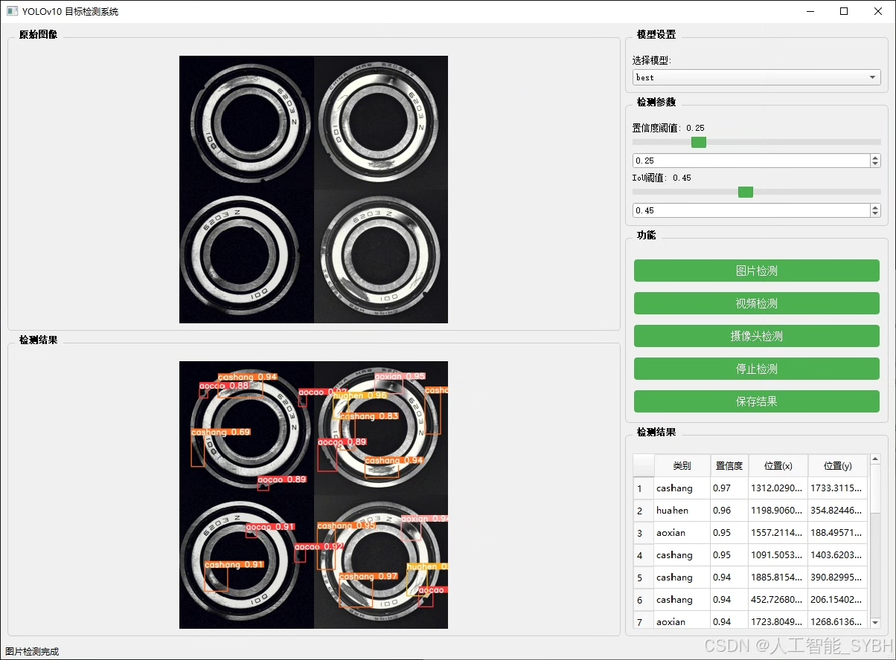
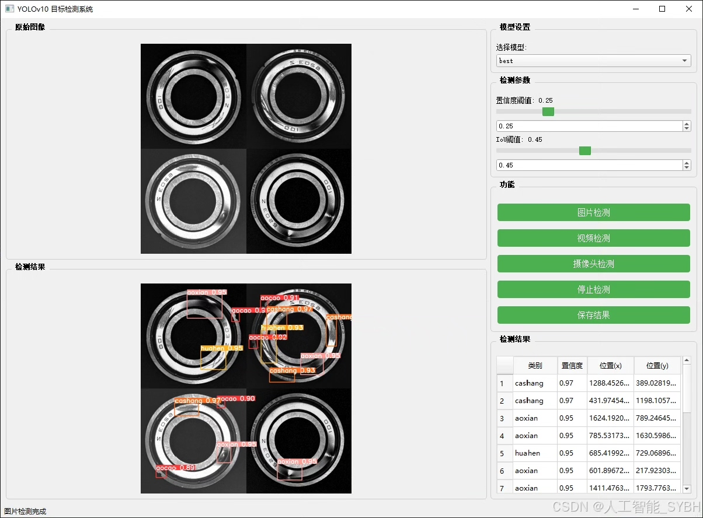
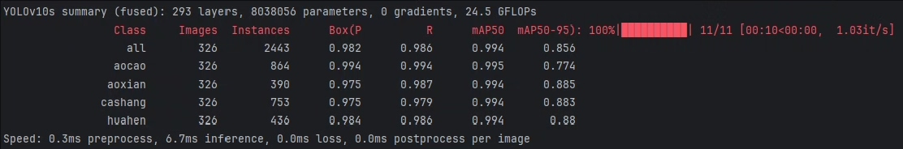
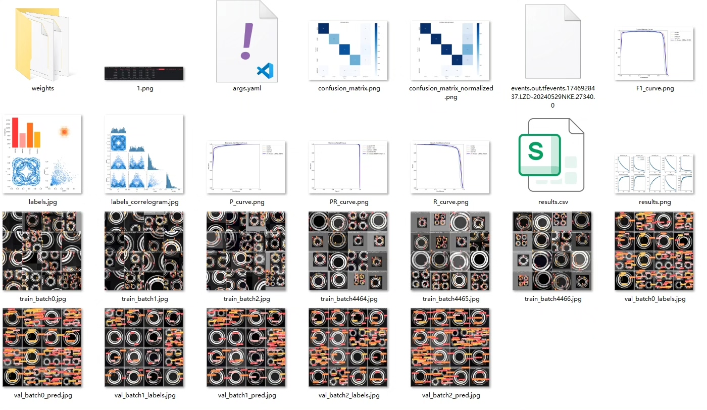
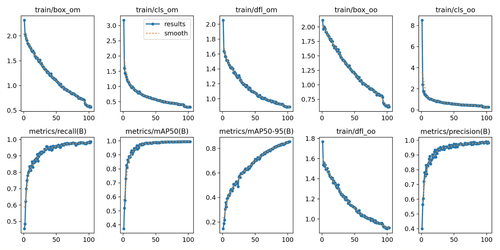
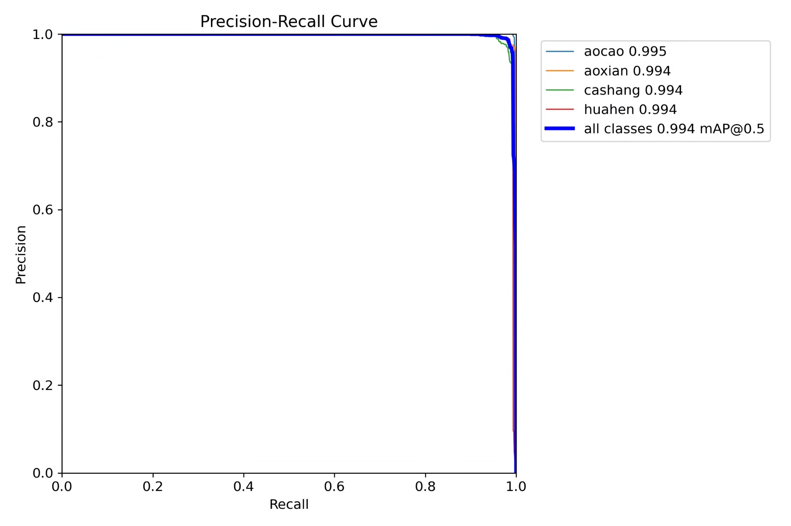
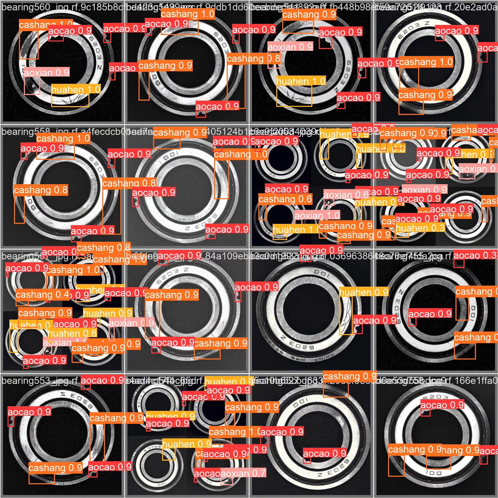
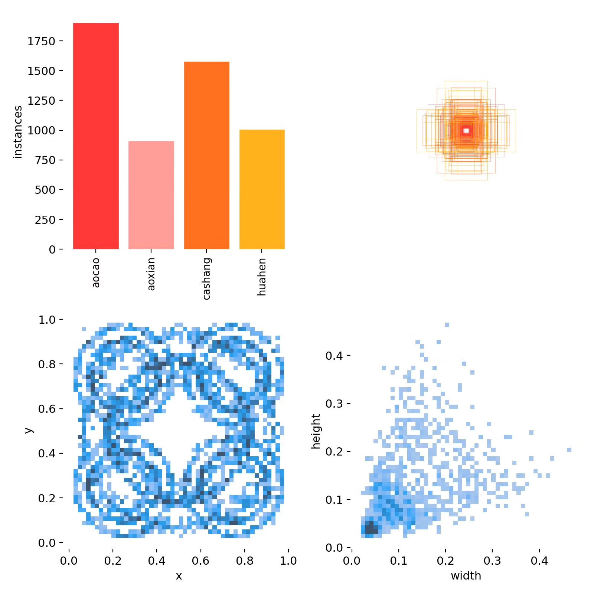

# Bearing Defect Detection System Based on Deep Learning YOLOv10

## Body

This project has developed an efficient bearing defect detection system based on the YOLOv10 object detection algorithm, specifically designed to identify and classify four common types of defects in industrial bearings: concave (aocao), concave line (aoxian), scratch (cashang), and scratch (huahen). The system utilizes a dataset containing 1085 high-quality bearing images (759 training set, 326 validation set) for model training and validation, achieving rapid and accurate detection of surface defects on bearings. This system can be widely applied in the quality inspection process of bearings on industrial production lines, significantly improving detection efficiency and accuracy, reducing labor costs, and providing strong support for the development of intelligent manufacturing and Industry 4.0.

The company's products have obtained the official commercial license certification from YOLO.

We provide after-sales service.

After payment, we will provide WeChat ID for instant questions.

Environmental configuration: We will provide a tutorial on environmental configuration, with WeChat available for Q&A.

Remote installation service: If you need remote configuration, an additional fee of 69 is required, with all fees refunded if the configuration fails (only the installation fee is refunded for older computers).

Retraining dataset: After setting up the environment, you can train on your own computer. If you need us to retrain, just pay 69 plus computing power fees (2.5 yuan/hour).

Full after-sales service

## Images

## Payment

Here is a pay link on Stripe ( https://buy.stripe.com/3cs8yP7sY87d0vu9AB ). Please contact me lonlonago@foxmail.com after funding $89, and I will send you a complete data files , thank you!

